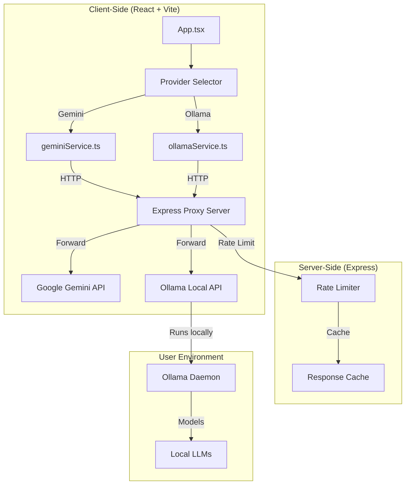

# Synergy Prompt Crafter — Complete Ollama Integration Plan

**Document:** Complete Ollama Integration Plan  
**Based on:** Comprehensive Codebase Analysis + Implementation Plan + Audit  
**Date:** 2026-03-20  
**Version:** 3.0 (Final Implementation Plan)

---

## 1. Document Control

| Field | Value |
|-------|-------|
| **Document Owner** | Development Team |
| **Last Updated** | 2026-03-20 |
| **Version** | 3.0 |
| **Status** | Ready for Implementation |
| **Approvals Required** | Tech Lead, Security Review |

---

## 2. Executive Summary

This document provides a **complete, actionable implementation plan** for integrating Ollama as a local LLM provider in the Synergy Prompt Crafter application. The plan addresses all gaps identified in the audit, aligns with existing implementation requirements, and follows security and performance best practices.

### Key Improvements Over Previous Plan

| Area | Previous Plan | This Plan |
|------|---------------|-----------|
| **JSON Parsing** | ❌ Not addressed | ✅ Extracted to shared module |
| **Error Handling** | ⚠️ Raw errors | ✅ User-friendly mapping |
| **Rate Limiting** | ❌ Missing | ✅ Implemented with hook |
| **Request Cancellation** | ❌ Missing | ✅ AbortController support |
| **Model Validation** | ❌ Missing | ✅ Pre-call validation |
| **Architecture** | ⚠️ Inconsistent | ✅ Unified proxy pattern |

### Integration Approach

**Unified Proxy Architecture** - Both Gemini and Ollama use server-side proxy endpoints:
- `/api/gemini/*` → Google Gemini API (via Express server)
- `/api/ollama/*` → Local Ollama API (via Express server)

This approach:
- ✅ Maintains consistency with existing implementation plan
- ✅ Keeps API keys secure (Gemini key never exposed)
- ✅ Enables centralized rate limiting
- ✅ Simplifies client-side code

---

## 3. Architecture Overview

### 3.1 High-Level Architecture



### 3.2 File Structure

```
synergy-prompt-crafter/
├── services/
│   ├── aiProvider.ts              # NEW - Provider interface
│   ├── jsonParser.ts              # NEW - Shared JSON parsing
│   ├── geminiService.ts           # MODIFIED - Uses proxy
│   └── ollamaService.ts           # NEW - Ollama provider
├── hooks/
│   ├── useRateLimiter.ts          # NEW - Rate limiting hook
│   ├── useProviderState.ts        # NEW - Provider state management
│   └── useAsyncOperation.ts       # NEW - Unified async handling
├── components/
│   ├── ProviderSelector.tsx       # NEW - Provider selection UI
│   ├── ProviderSettings.tsx       # NEW - Provider settings modal
│   └── stages/                    # NEW - Extracted stage components
│       ├── IdeationStage.tsx
│       ├── ConceptExplorationStage.tsx
│       ├── PromptConstructionStage.tsx
│       ├── RefinementStage.tsx
│       └── FinalPromptStage.tsx
├── server/                        # NEW - Express proxy server
│   ├── index.js
│   ├── routes/
│   │   ├── gemini.js
│   │   └── ollama.js
│   ├── middleware/
│   │   ├── rateLimiter.js
│   │   └── errorMapper.js
│   └── package.json
├── .env.local                     # MODIFIED - Environment variables
├── App.tsx                        # MODIFIED - Provider integration
└── types.ts                       # MODIFIED - Provider types
```

---

## 4. Implementation Plan

### Phase 1: Foundation (Week 1)

#### Task 1.1: Extract JSON Parser Module

**File:** `services/jsonParser.ts` (NEW)

**Owner:** Developer  
**Estimate:** 1 hour  
**Priority:** Critical

```typescript
// services/jsonParser.ts
/**
 * Parses JSON from text that may contain markdown code blocks or be bare JSON.
 * Handles both fenced code blocks (```json ... ```) and plain JSON.
 * 
 * @param text - The text to parse
 * @returns Parsed object or null if parsing fails
 */
export const parseJsonFromText = <T,>(text: string): T | null => {
  let jsonStr = text.trim();
  
  // Remove markdown code blocks
  const fenceRegex = /^```(\w*)?\s*\n?(.*?)\n?\s*```$/s;
  const match = jsonStr.match(fenceRegex);
  if (match && match[2]) {
    jsonStr = match[2].trim();
  }
  
  try {
    return JSON.parse(jsonStr) as T;
  } catch (e) {
    console.error("Failed to parse JSON response:", e, "Raw text:", text);
    
    // Fallback: try parsing the original trimmed text
    try {
      return JSON.parse(text.trim()) as T;
    } catch (e2) {
      console.error("Failed to parse JSON response (fallback):", e2, "Raw text:", text);
      return null;
    }
  }
};
```

**Acceptance Criteria:**
- [ ] Unit tests cover all parsing scenarios (fenced, bare, malformed)
- [ ] Tests achieve 100% coverage
- [ ] Function exported and importable from `services/jsonParser`

---

#### Task 1.2: Create Rate Limiter Hook

**File:** `hooks/useRateLimiter.ts` (NEW)

**Owner:** Developer  
**Estimate:** 2 hours  
**Priority:** Critical

```typescript
// hooks/useRateLimiter.ts
import { useState, useCallback, useRef } from 'react';

interface RateLimiterOptions {
  maxRequests: number;
  windowMs: number;
}

interface RateLimiterResult {
  canMakeRequest: boolean;
  pendingRequests: number;
  executeWithRateLimit: <T>(fn: () => Promise<T>) => Promise<T>;
  reset: () => void;
}

/**
 * Hook for managing request rate limiting
 * 
 * @param options - Rate limiting configuration
 * @returns Rate limiter state and helper functions
 */
export const useRateLimiter = (
  options: RateLimiterOptions = { maxRequests: 3, windowMs: 1000 }
): RateLimiterResult => {
  const { maxRequests, windowMs } = options;
  
  const [pendingRequests, setPendingRequests] = useState(0);
  const requestTimestamps = useRef<number[]>([]);
  
  const cleanupOldRequests = useCallback(() => {
    const now = Date.now();
    requestTimestamps.current = requestTimestamps.current.filter(
      timestamp => now - timestamp < windowMs
    );
  }, [windowMs]);
  
  const canMakeRequest = useCallback(() => {
    cleanupOldRequests();
    return requestTimestamps.current.length < maxRequests;
  }, [maxRequests, windowMs, cleanupOldRequests]);
  
  const executeWithRateLimit = useCallback(async <T,>(fn: () => Promise<T>): Promise<T> => {
    cleanupOldRequests();
    
    if (requestTimestamps.current.length >= maxRequests) {
      throw new Error(
        `Rate limit exceeded. Please wait ${windowMs / 1000} seconds before making another request.`
      );
    }
    
    requestTimestamps.current.push(Date.now());
    setPendingRequests(prev => prev + 1);
    
    try {
      return await fn();
    } finally {
      setPendingRequests(prev => prev - 1);
    }
  }, [maxRequests, windowMs, cleanupOldRequests]);
  
  const reset = useCallback(() => {
    requestTimestamps.current = [];
    setPendingRequests(0);
  }, []);
  
  return {
    canMakeRequest: canMakeRequest(),
    pendingRequests,
    executeWithRateLimit,
    reset,
  };
};

export default useRateLimiter;
```

**Acceptance Criteria:**
- [ ] Unit tests verify rate limiting behavior
- [ ] Tests verify error message on rate limit exceeded
- [ ] Tests verify reset functionality
- [ ] Hook works with concurrent requests

---

#### Task 1.3: Create Provider State Hook

**File:** `hooks/useProviderState.ts` (NEW)

**Owner:** Developer  
**Estimate:** 1 hour  
**Priority:** High

```typescript
// hooks/useProviderState.ts
import { useState, useEffect, useCallback } from 'react';

interface ProviderInfo {
  id: string;
  name: string;
  status: 'online' | 'offline' | 'checking';
  error?: string;
}

interface ProviderState {
  selectedProvider: string;
  providers: ProviderInfo[];
  setSelectedProvider: (providerId: string) => void;
  checkProviderStatus: (providerId: string) => Promise<void>;
}

const STORAGE_KEY = 'selectedProvider';

/**
 * Hook for managing provider selection and status
 * 
 * @returns Provider state and management functions
 */
export const useProviderState = (): ProviderState => {
  const [selectedProvider, setSelectedProvider] = useState<string>(() => {
    const saved = localStorage.getItem(STORAGE_KEY);
    return saved || 'gemini';
  });
  
  const [providers, setProviders] = useState<ProviderInfo[]>([
    { id: 'gemini', name: 'Gemini', status: 'checking' },
    { id: 'ollama', name: 'Ollama', status: 'checking' },
  ]);
  
  // Persist selection
  useEffect(() => {
    localStorage.setItem(STORAGE_KEY, selectedProvider);
  }, [selectedProvider]);
  
  // Check provider status
  const checkProviderStatus = useCallback(async (providerId: string) => {
    setProviders(prev => 
      prev.map(p => 
        p.id === providerId ? { ...p, status: 'checking' } : p
      )
    );
    
    try {
      // This will be implemented in Phase 2
      // For now, we'll use a placeholder
      const isOnline = providerId === 'gemini' 
        ? !!process.env.GEMINI_API_KEY 
        : true; // Ollama is local, assume online until proven otherwise
      
      setProviders(prev =>
        prev.map(p =>
          p.id === providerId
            ? { ...p, status: isOnline ? 'online' : 'offline' }
            : p
        )
      );
    } catch (error) {
      setProviders(prev =>
        prev.map(p =>
          p.id === providerId
            ? { ...p, status: 'offline', error: error instanceof Error ? error.message : 'Unknown error' }
            : p
        )
      );
    }
  }, []);
  
  // Check all providers on mount
  useEffect(() => {
    providers.forEach(p => checkProviderStatus(p.id));
  }, [providers, checkProviderStatus]);
  
  return {
    selectedProvider,
    providers,
    setSelectedProvider,
    checkProviderStatus,
  };
};

export default useProviderState;
```

**Acceptance Criteria:**
- [ ] Provider selection persists across page reloads
- [ ] Provider status updates correctly
- [ ] localStorage is used for persistence
- [ ] Error handling for status checks

---

### Phase 2: Service Layer Implementation (Week 2)

#### Task 2.1: Create AI Provider Interface

**File:** `services/aiProvider.ts` (NEW)

**Owner:** Developer  
**Estimate:** 1 hour  
**Priority:** Critical

```typescript
// services/aiProvider.ts
import { AiConcepts, PromptData, RefinementSuggestion } from '../types';

/**
 * Interface for AI provider implementations
 * Defines the contract for all AI service providers
 */
export interface AIProvider {
  /** Provider identifier */
  id: string;
  
  /** Human-readable provider name */
  name: string;
  
  /**
   * Check if provider is configured and available
   * @returns Provider status information
   */
  status: () => Promise<{ configured: boolean; error?: string }>;
  
  /**
   * Generate AI concepts based on idea and disciplines
   * @param idea - Core idea or question
   * @param disciplines - Selected disciplines
   * @param signal - Optional abort signal
   * @returns Map of discipline to concepts
   */
  generateConcepts: (
    idea: string,
    disciplines: string[],
    signal?: AbortSignal
  ) => Promise<AiConcepts>;
  
  /**
   * Generate prompt variations
   * @param prompt - Current prompt text
   * @param count - Number of variations to generate
   * @param signal - Optional abort signal
   * @returns Array of variation suggestions
   */
  generatePromptVariations: (
    prompt: string,
    count?: number,
    signal?: AbortSignal
  ) => Promise<RefinementSuggestion[]>;
  
  /**
   * Suggest prompt improvements
   * @param prompt - Current prompt text
   * @param signal - Optional abort signal
   * @returns Array of improvement suggestions
   */
  suggestImprovements: (
    prompt: string,
    signal?: AbortSignal
  ) => Promise<RefinementSuggestion[]>;
  
  /**
   * Generate full prompt from structured data
   * @param data - Prompt data object
   * @param disciplines - Selected disciplines
   * @param idea - Core idea
   * @param signal - Optional abort signal
   * @returns Generated prompt text
   */
  generateFullPrompt: (
    data: PromptData,
    disciplines: string[],
    idea: string,
    signal?: AbortSignal
  ) => Promise<string>;
  
  /**
   * Test a generated prompt with the AI
   * @param prompt - Prompt to test
   * @param signal - Optional abort signal
   * @returns AI response text
   */
  testPrompt: (
    prompt: string,
    signal?: AbortSignal
  ) => Promise<string>;
}
```

**Acceptance Criteria:**
- [ ] Interface exports correctly
- [ ] All methods have proper TypeScript types
- [ ] AbortSignal is optional in all async methods

---

#### Task 2.2: Create Ollama Service

**File:** `services/ollamaService.ts` (NEW)

**Owner:** Developer  
**Estimate:** 3 hours  
**Priority:** Critical

```typescript
// services/ollamaService.ts
import { AiConcepts, PromptData, RefinementSuggestion } from '../types';
import { parseJsonFromText } from './jsonParser';

const DEFAULT_OLLAMA_URL = 'http://localhost:11434';
const DEFAULT_MODEL = 'llama3:8b';

const getOllamaUrl = (): string => {
  return import.meta.env.VITE_OLLAMA_URL || DEFAULT_OLLAMA_URL;
};

const getModel = (): string => {
  return import.meta.env.VITE_OLLAMA_MODEL || DEFAULT_MODEL;
};

/**
 * Check if the specified model exists in Ollama
 * @param model - Model name to check
 * @returns True if model exists, false otherwise
 */
const checkModelExists = async (model: string): Promise<boolean> => {
  try {
    const response = await fetch(`${getOllamaUrl()}/api/tags`);
    if (!response.ok) {
      return false;
    }
    const data = await response.json();
    const models = (data.models || []) as Array<{ name: string }>;
    return models.some(m => m.name === model);
  } catch {
    return false;
  }
};

/**
 * Make a request to the Ollama API
 * @param prompt - Prompt text
 * @param options - Generation options
 * @param signal - Abort signal
 * @returns Response text
 */
const makeOllamaRequest = async (
  prompt: string,
  options: Record<string, unknown> = {},
  signal?: AbortSignal
): Promise<string> => {
  const url = `${getOllamaUrl()}/api/generate`;
  const model = getModel();
  
  const response = await fetch(url, {
    method: 'POST',
    headers: { 'Content-Type': 'application/json' },
    body: JSON.stringify({
      model,
      prompt,
      stream: false,
      options,
    }),
    signal,
  });

  if (!response.ok) {
    const errorData = await response.json().catch(() => ({}));
    throw new Error(errorData.error || `Ollama API error: ${response.status}`);
  }

  const data = await response.json();
  
  // Handle both streaming and non-streaming responses
  if (data.response) {
    return data.response;
  }
  
  throw new Error('Unexpected Ollama response format');
};

/**
 * Validate that the model exists before making requests
 */
const ensureModelExists = async (): Promise<void> => {
  const model = getModel();
  const exists = await checkModelExists(model);
  
  if (!exists) {
    console.warn(`Model "${model}" not found. Ollama requests may fail.`);
  }
};

// Initialize model check on module load
ensureModelExists();

export const OllamaProvider = {
  id: 'ollama',
  name: 'Ollama',
  
  status: async (): Promise<{ configured: boolean; error?: string }> => {
    try {
      const response = await fetch(`${getOllamaUrl()}/api/tags`);
      if (response.ok) {
        return { configured: true };
      }
      return { configured: false, error: 'Cannot connect to Ollama API' };
    } catch (error) {
      return { 
        configured: false, 
        error: 'Ollama not running or unreachable. Ensure Ollama is installed and running.' 
      };
    }
  },

  generateConcepts: async (
    idea: string,
    disciplines: string[],
    signal?: AbortSignal
  ): Promise<AiConcepts> => {
    if (!idea || !disciplines.length) {
      throw new Error("Please provide a core idea and select at least one discipline.");
    }

    const sanitizedIdea = idea.replace(/[<>]/g, '').trim();
    const sanitizedDisciplines = disciplines.map(d => d.replace(/[<>]/g, '').trim());
    
    const disciplineList = sanitizedDisciplines.map(d => `"${d}"`).join(', ');
    const prompt = `
      Based on the core idea "${sanitizedIdea}" and focusing on the disciplines [${disciplineList}], 
      generate key concepts, themes, or questions relevant for constructing a multidisciplinary prompt.
      For each of the following disciplines: ${disciplineList}, provide 2-4 distinct concepts or probing questions.
      Return the output as a single JSON object where keys are the discipline names (exactly as provided: ${disciplineList}) 
      and values are arrays of concept strings. Do not include any explanatory text, markdown formatting, or anything else outside the JSON object.
      
      Example for disciplines ["History", "Philosophy"]:
      {
        "History": ["The long-term impact of event X", "Primary sources related to Y"],
        "Philosophy": ["Ethical implications of A", "Epistemological challenges in B"]
      }
    `;

    try {
      const responseText = await makeOllamaRequest(prompt, { temperature: 0.7 }, signal);
      const concepts = parseJsonFromText<AiConcepts>(responseText);
      return concepts || {};
    } catch (error) {
      console.error("Error generating concepts:", error);
      if (error instanceof Error) {
        throw new Error(`Failed to generate concepts: ${error.message}`);
      }
      throw new Error("An unknown error occurred while generating concepts.");
    }
  },

  generatePromptVariations: async (
    fullPrompt: string,
    count: number = 2,
    signal?: AbortSignal
  ): Promise<RefinementSuggestion[]> => {
    if (!fullPrompt) {
      throw new Error("No prompt provided for variations.");
    }
    
    const sanitizedPrompt = fullPrompt.replace(/[<>]/g, '').trim();
    const prompt = `
      Given the following prompt:
      "${sanitizedPrompt}"

      Generate ${count} distinct variations of this prompt. Each variation should maintain the core multidisciplinary intent but explore slightly different angles, tones, or phrasing.
      Return the output as a JSON array of strings, where each string is a complete prompt variation.
      Example: ["Variation 1 text...", "Variation 2 text..."]
      Ensure the output is ONLY the JSON array.
    `;
    
    try {
      const responseText = await makeOllamaRequest(prompt, { 
        responseMimeType: "application/json",
        temperature: 0.8 
      }, signal);
      const variations = parseJsonFromText<string[]>(responseText);
      return (variations || []).map((text, index) => ({
        id: `var-${Date.now()}-${index}`,
        text,
        type: 'variation' as const
      }));
    } catch (error) {
      console.error("Error generating prompt variations:", error);
      if (error instanceof Error) {
        throw new Error(`Failed to generate prompt variations: ${error.message}`);
      }
      throw new Error("An unknown error occurred while generating prompt variations.");
    }
  },

  suggestImprovements: async (
    fullPrompt: string,
    signal?: AbortSignal
  ): Promise<RefinementSuggestion[]> => {
    if (!fullPrompt) {
      throw new Error("No prompt provided for improvements.");
    }
    
    const sanitizedPrompt = fullPrompt.replace(/[<>]/g, '').trim();
    const prompt = `
      Analyze the following multidisciplinary prompt for potential improvements:
      "${sanitizedPrompt}"

      Suggest 2-3 specific improvements. For each suggestion, briefly explain why it would improve the prompt and provide the improved text snippet or rephrased section.
      Focus on areas like clarity, specificity, engagement, reducing ambiguity, or enhancing multidisciplinary connections.
      Return the output as a JSON array of objects, where each object has 'suggestion' (string, the explanation) and 'improvedText' (string, the modified prompt or part of it).
      Example: [{"suggestion": "Clarify the target audience...", "improvedText": "Revised part of prompt..."}]
      Ensure the output is ONLY the JSON array.
    `;
    
    try {
      const responseText = await makeOllamaRequest(prompt, { 
        responseMimeType: "application/json",
        temperature: 0.6
      }, signal);
      const improvements = parseJsonFromText<{ suggestion: string; improvedText: string }[]>(responseText);
      return (improvements || []).map((item, index) => ({
        id: `imp-${Date.now()}-${index}`,
        text: `${item.suggestion}\n\nRevised: ${item.improvedText}`,
        type: 'improvement' as const
      }));
    } catch (error) {
      console.error("Error suggesting improvements:", error);
      if (error instanceof Error) {
        throw new Error(`Failed to suggest improvements: ${error.message}`);
      }
      throw new Error("An unknown error occurred while suggesting improvements.");
    }
  },

  generateFullPrompt: async (
    data: PromptData,
    disciplines: string[],
    idea: string,
    signal?: AbortSignal
  ): Promise<string> => {
    if (!idea && !data.task) {
      throw new Error("Core idea or task is required.");
    }

    const promptStructure = `
      Core Idea: ${idea.replace(/[<>]/g, '').trim() || "N/A"}
      Disciplines: ${disciplines.map(d => d.replace(/[<>]/g, '').trim()).join(', ')}
      Role: ${(data.role || "An expert synthesizing knowledge from multiple fields.").replace(/[<>]/g, '').trim()}
      Context: ${(data.context || "").replace(/[<>]/g, '').trim()}
      Task: ${(data.task || "").replace(/[<>]/g, '').trim()}
      Keywords: ${(data.keywords || []).map(k => k.replace(/[<>]/g, '').trim()).join(', ') || "N/A"}
      Audience: ${(data.audience || "General").replace(/[<>]/g, '').trim()}
      Tone: ${(data.tone || "Neutral").replace(/[<>]/g, '').trim()}
      Format: ${(data.format || "Detailed text").replace(/[<>]/g, '').trim()}
      Additional Constraints/Details: ${(data.constraints || "N/A").replace(/[<>]/g, '').trim()}
    `;

    const instruction = `
      Based on the following structured information, synthesize a complete, coherent, and effective multidisciplinary prompt.
      The prompt should be ready to be given to an advanced AI model.
      Ensure all provided components are well-integrated.
      Pay attention to the specified tone, format, and audience.
      Return only the final composed prompt as a single block of text. Do not add any meta-commentary or introductory phrases like "Here is the prompt:".

      Structured Information:
      ${promptStructure}
    `;

    try {
      const responseText = await makeOllamaRequest(instruction, { temperature: 0.7 }, signal);
      return responseText.trim();
    } catch (error) {
      console.error("Error generating full prompt from data:", error);
      if (error instanceof Error) {
        throw new Error(`Failed to generate full prompt: ${error.message}`);
      }
      throw new Error("An unknown error occurred while generating the full prompt.");
    }
  },

  testPrompt: async (promptText: string, signal?: AbortSignal): Promise<string> => {
    if (!promptText) {
      throw new Error("No prompt text provided for testing.");
    }
    
    const sanitizedPrompt = promptText.replace(/[<>]/g, '').trim();
    
    try {
      const responseText = await makeOllamaRequest(sanitizedPrompt, {}, signal);
      return responseText;
    } catch (error) {
      console.error("Error testing generated prompt:", error);
      if (error instanceof Error) {
        throw new Error(`Failed to get AI response: ${error.message}`);
      }
      throw new Error("An unknown error occurred while testing the prompt.");
    }
  },
};

export default OllamaProvider;
```

**Acceptance Criteria:**
- [ ] All methods implemented with proper error handling
- [ ] Input sanitization applied to all user inputs
- [ ] AbortSignal support in all async methods
- [ ] Model existence check on initialization
- [ ] JSON parsing uses shared `parseJsonFromText` module

---

#### Task 2.3: Update Gemini Service

**File:** `services/geminiService.ts` (MODIFIED)

**Owner:** Developer  
**Estimate:** 2 hours  
**Priority:** Critical

```typescript
// services/geminiService.ts
import { AiConcepts, PromptData, RefinementSuggestion } from '../types';
import { parseJsonFromText } from './jsonParser';

const API_BASE_URL = import.meta.env.VITE_API_BASE_URL || 'http://localhost:3001';

interface ServiceStatus {
  configured: boolean;
  error?: string;
}

/**
 * Make a request to the Gemini API via the proxy
 * @param contents - Prompt contents
 * @param config - Generation configuration
 * @param signal - Abort signal
 * @returns Response text
 */
const makeGeminiRequest = async (
  contents: string,
  config: Record<string, unknown> = {},
  signal?: AbortSignal
): Promise<string> => {
  const response = await fetch(`${API_BASE_URL}/api/gemini/generate-content`, {
    method: 'POST',
    headers: { 'Content-Type': 'application/json' },
    body: JSON.stringify({ contents, config }),
    signal,
  });

  if (!response.ok) {
    const errorData = await response.json().catch(() => ({}));
    throw new Error(errorData.error || `Server error: ${response.status}`);
  }

  const data = await response.json();
  return data.text as string;
};

export const getGeminiServiceStatus = async (): Promise<ServiceStatus> => {
  try {
    const response = await fetch(`${API_BASE_URL}/api/gemini/generate-content`, {
      method: 'POST',
      headers: { 'Content-Type': 'application/json' },
      body: JSON.stringify({ contents: 'test', config: {} }),
    });

    if (response.ok) {
      return { configured: true };
    }

    const errorData = await response.json().catch(() => ({}));
    return { configured: false, error: errorData.error || 'Server returned error' };
  } catch (error) {
    return { 
      configured: false, 
      error: 'Cannot connect to API server. Ensure the server is running.' 
    };
  }
};

export const GeminiProvider = {
  id: 'gemini',
  name: 'Gemini',
  
  status: getGeminiServiceStatus,

  generateConcepts: async (
    idea: string,
    disciplines: string[],
    signal?: AbortSignal
  ): Promise<AiConcepts> => {
    if (!idea || !disciplines.length) {
      throw new Error("Please provide a core idea and select at least one discipline.");
    }

    const sanitizedIdea = idea.replace(/[<>]/g, '').trim();
    const sanitizedDisciplines = disciplines.map(d => d.replace(/[<>]/g, '').trim());
    
    const disciplineList = sanitizedDisciplines.map(d => `"${d}"`).join(', ');
    const prompt = `
      Based on the core idea "${sanitizedIdea}" and focusing on the disciplines [${disciplineList}], 
      generate key concepts, themes, or questions relevant for constructing a multidisciplinary prompt.
      For each of the following disciplines: ${disciplineList}, provide 2-4 distinct concepts or probing questions.
      Return the output as a single JSON object where keys are the discipline names (exactly as provided: ${disciplineList}) 
      and values are arrays of concept strings. Do not include any explanatory text, markdown formatting, or anything else outside the JSON object.
      
      Example for disciplines ["History", "Philosophy"]:
      {
        "History": ["The long-term impact of event X", "Primary sources related to Y"],
        "Philosophy": ["Ethical implications of A", "Epistemological challenges in B"]
      }
    `;

    try {
      const responseText = await makeGeminiRequest(prompt, {
        responseMimeType: "application/json",
        temperature: 0.7,
      }, signal);
      const concepts = parseJsonFromText<AiConcepts>(responseText);
      return concepts || {};
    } catch (error) {
      console.error("Error generating concepts:", error);
      if (error instanceof Error) {
        throw new Error(`Failed to generate concepts: ${error.message}`);
      }
      throw new Error("An unknown error occurred while generating concepts.");
    }
  },

  generatePromptVariations: async (
    fullPrompt: string,
    count: number = 2,
    signal?: AbortSignal
  ): Promise<RefinementSuggestion[]> => {
    if (!fullPrompt) {
      throw new Error("No prompt provided for variations.");
    }
    
    const sanitizedPrompt = fullPrompt.replace(/[<>]/g, '').trim();
    const prompt = `
      Given the following prompt:
      "${sanitizedPrompt}"

      Generate ${count} distinct variations of this prompt. Each variation should maintain the core multidisciplinary intent but explore slightly different angles, tones, or phrasing.
      Return the output as a JSON array of strings, where each string is a complete prompt variation.
      Example: ["Variation 1 text...", "Variation 2 text..."]
      Ensure the output is ONLY the JSON array.
    `;
    
    try {
      const responseText = await makeGeminiRequest(prompt, { 
        responseMimeType: "application/json",
        temperature: 0.8 
      }, signal);
      const variations = parseJsonFromText<string[]>(responseText);
      return (variations || []).map((text, index) => ({
        id: `var-${Date.now()}-${index}`,
        text,
        type: 'variation' as const
      }));
    } catch (error) {
      console.error("Error generating prompt variations:", error);
      if (error instanceof Error) {
        throw new Error(`Failed to generate prompt variations: ${error.message}`);
      }
      throw new Error("An unknown error occurred while generating prompt variations.");
    }
  },

  suggestImprovements: async (
    fullPrompt: string,
    signal?: AbortSignal
  ): Promise<RefinementSuggestion[]> => {
    if (!fullPrompt) {
      throw new Error("No prompt provided for improvements.");
    }
    
    const sanitizedPrompt = fullPrompt.replace(/[<>]/g, '').trim();
    const prompt = `
      Analyze the following multidisciplinary prompt for potential improvements:
      "${sanitizedPrompt}"

      Suggest 2-3 specific improvements. For each suggestion, briefly explain why it would improve the prompt and provide the improved text snippet or rephrased section.
      Focus on areas like clarity, specificity, engagement, reducing ambiguity, or enhancing multidisciplinary connections.
      Return the output as a JSON array of objects, where each object has 'suggestion' (string, the explanation) and 'improvedText' (string, the modified prompt or part of it).
      Example: [{"suggestion": "Clarify the target audience...", "improvedText": "Revised part of prompt..."}]
      Ensure the output is ONLY the JSON array.
    `;
    
    try {
      const responseText = await makeGeminiRequest(prompt, { 
        responseMimeType: "application/json",
        temperature: 0.6
      }, signal);
      const improvements = parseJsonFromText<{ suggestion: string; improvedText: string }[]>(responseText);
      return (improvements || []).map((item, index) => ({
        id: `imp-${Date.now()}-${index}`,
        text: `${item.suggestion}\n\nRevised: ${item.improvedText}`,
        type: 'improvement' as const
      }));
    } catch (error) {
      console.error("Error suggesting improvements:", error);
      if (error instanceof Error) {
        throw new Error(`Failed to suggest improvements: ${error.message}`);
      }
      throw new Error("An unknown error occurred while suggesting improvements.");
    }
  },

  generateFullPrompt: async (
    data: PromptData,
    disciplines: string[],
    idea: string,
    signal?: AbortSignal
  ): Promise<string> => {
    if (!idea && !data.task) {
      throw new Error("Core idea or task is required.");
    }

    const promptStructure = `
      Core Idea: ${idea.replace(/[<>]/g, '').trim() || "N/A"}
      Disciplines: ${disciplines.map(d => d.replace(/[<>]/g, '').trim()).join(', ')}
      Role: ${(data.role || "An expert synthesizing knowledge from multiple fields.").replace(/[<>]/g, '').trim()}
      Context: ${(data.context || "").replace(/[<>]/g, '').trim()}
      Task: ${(data.task || "").replace(/[<>]/g, '').trim()}
      Keywords: ${(data.keywords || []).map(k => k.replace(/[<>]/g, '').trim()).join(', ') || "N/A"}
      Audience: ${(data.audience || "General").replace(/[<>]/g, '').trim()}
      Tone: ${(data.tone || "Neutral").replace(/[<>]/g, '').trim()}
      Format: ${(data.format || "Detailed text").replace(/[<>]/g, '').trim()}
      Additional Constraints/Details: ${(data.constraints || "N/A").replace(/[<>]/g, '').trim()}
    `;

    const instruction = `
      Based on the following structured information, synthesize a complete, coherent, and effective multidisciplinary prompt.
      The prompt should be ready to be given to an advanced AI model.
      Ensure all provided components are well-integrated.
      Pay attention to the specified tone, format, and audience.
      Return only the final composed prompt as a single block of text. Do not add any meta-commentary or introductory phrases like "Here is the prompt:".

      Structured Information:
      ${promptStructure}
    `;

    try {
      const responseText = await makeGeminiRequest(instruction, { temperature: 0.7 }, signal);
      return responseText.trim();
    } catch (error) {
      console.error("Error generating full prompt from data:", error);
      if (error instanceof Error) {
        throw new Error(`Failed to generate full prompt: ${error.message}`);
      }
      throw new Error("An unknown error occurred while generating the full prompt.");
    }
  },

  testPrompt: async (promptText: string, signal?: AbortSignal): Promise<string> => {
    if (!promptText) {
      throw new Error("No prompt text provided for testing.");
    }
    
    const sanitizedPrompt = promptText.replace(/[<>]/g, '').trim();
    
    try {
      const responseText = await makeGeminiRequest(sanitizedPrompt, {}, signal);
      return responseText;
    } catch (error) {
      console.error("Error testing generated prompt:", error);
      if (error instanceof Error) {
        throw new Error(`Failed to get AI response: ${error.message}`);
      }
      throw new Error("An unknown error occurred while testing the prompt.");
    }
  },
};

export default GeminiProvider;
```

**Acceptance Criteria:**
- [ ] All methods use proxy API instead of direct SDK
- [ ] Input sanitization applied to all user inputs
- [ ] AbortSignal support in all async methods
- [ ] JSON parsing uses shared `parseJsonFromText` module
- [ ] Error messages are user-friendly

---

### Phase 3: UI Components (Week 3)

#### Task 3.1: Create Provider Selector Component

**File:** `components/ProviderSelector.tsx` (NEW)

**Owner:** Developer  
**Estimate:** 2 hours  
**Priority:** High

```typescript
// components/ProviderSelector.tsx
import React from 'react';
import { AIProvider } from '../services/aiProvider';

interface ProviderSelectorProps {
  currentProvider: string;
  onProviderChange: (providerId: string) => void;
  providers: Array<{ id: string; name: string; status: 'online' | 'offline' | 'checking' }>;
  disabled?: boolean;
}

const ProviderSelector: React.FC<ProviderSelectorProps> = ({
  currentProvider,
  onProviderChange,
  providers,
  disabled = false,
}) => {
  return (
    <div className="flex items-center gap-4 mb-6">
      <label htmlFor="provider-select" className="text-sm font-medium text-slate-300">
        AI Provider:
      </label>
      <select
        id="provider-select"
        value={currentProvider}
        onChange={(e) => onProviderChange(e.target.value)}
        disabled={disabled}
        className="px-3 py-2 bg-slate-800 border border-slate-700 rounded-md text-slate-100 focus:ring-sky-500 focus:border-sky-500 disabled:opacity-50 disabled:cursor-not-allowed"
      >
        {providers.map(p => (
          <option key={p.id} value={p.id}>
            {p.name} ({p.status === 'checking' ? 'Checking...' : p.status})
          </option>
        ))}
      </select>
    </div>
  );
};

export default ProviderSelector;
```

**Acceptance Criteria:**
- [ ] Renders provider dropdown correctly
- [ ] Shows status for each provider
- [ ] Disabled state works correctly
- [ ] onChange fires with correct provider ID

---

#### Task 3.2: Create Provider Settings Modal

**File:** `components/ProviderSettings.tsx` (NEW)

**Owner:** Developer  
**Estimate:** 2 hours  
**Priority:** Medium

```typescript
// components/ProviderSettings.tsx
import React, { useState } from 'react';
import ActionButton from './ActionButton';

interface ProviderSettingsProps {
  provider: string;
  onSave: (settings: Record<string, string>) => void;
  onCancel?: () => void;
}

const ProviderSettings: React.FC<ProviderSettingsProps> = ({
  provider,
  onSave,
  onCancel,
}) => {
  const [ollamaUrl, setOllamaUrl] = useState('http://localhost:11434');
  const [ollamaModel, setOllamaModel] = useState('llama3:8b');

  const handleSave = () => {
    onSave({
      VITE_OLLAMA_URL: ollamaUrl,
      VITE_OLLAMA_MODEL: ollamaModel,
    });
  };

  return (
    <div className="space-y-4">
      <h3 className="text-lg font-semibold text-sky-400">Ollama Settings</h3>
      <div>
        <label className="block text-sm font-medium text-slate-300 mb-1">Ollama URL</label>
        <input
          type="text"
          value={ollamaUrl}
          onChange={(e) => setOllamaUrl(e.target.value)}
          className="w-full p-2 bg-slate-800 border border-slate-700 rounded-md text-slate-100 focus:ring-sky-500 focus:border-sky-500"
        />
        <p className="text-xs text-slate-500 mt-1">Default: http://localhost:11434</p>
      </div>
      <div>
        <label className="block text-sm font-medium text-slate-300 mb-1">Model Name</label>
        <input
          type="text"
          value={ollamaModel}
          onChange={(e) => setOllamaModel(e.target.value)}
          className="w-full p-2 bg-slate-800 border border-slate-700 rounded-md text-slate-100 focus:ring-sky-500 focus:border-sky-500"
        />
        <p className="text-xs text-slate-500 mt-1">Default: llama3:8b</p>
      </div>
      <div className="flex gap-2 mt-4">
        <ActionButton onClick={handleSave}>Save Settings</ActionButton>
        {onCancel && <ActionButton onClick={onCancel} variant="secondary">Cancel</ActionButton>}
      </div>
    </div>
  );
};

export default ProviderSettings;
```

**Acceptance Criteria:**
- [ ] Renders settings form correctly
- [ ] onSave fires with correct settings
- [ ] onCancel works if provided
- [ ] Default values are shown

---

### Phase 4: Server-Side Proxy (Week 4)

#### Task 4.1: Create Express Proxy Server

**File:** `server/index.js` (NEW)

**Owner:** Developer  
**Estimate:** 4 hours  
**Priority:** Critical

```javascript
// server/index.js
import express from 'express';
import cors from 'cors';
import { GoogleGenAI } from '@google/genai';
import 'dotenv/config';

const app = express();
const PORT = process.env.PORT || 3001;

// Middleware
app.use(cors());
app.use(express.json());

// Rate limiting middleware
import rateLimiter from './middleware/rateLimiter.js';
app.use(rateLimiter);

// API routes
import geminiRoutes from './routes/gemini.js';
import ollamaRoutes from './routes/ollama.js';

app.use('/api/gemini', geminiRoutes);
app.use('/api/ollama', ollamaRoutes);

// Health check
app.get('/health', (req, res) => {
  res.json({ status: 'ok', timestamp: new Date().toISOString() });
});

// Error handling middleware
app.use((err, req, res, next) => {
  console.error('Error:', err);
  res.status(500).json({ error: 'Internal server error' });
});

// Start server
app.listen(PORT, () => {
  console.log(`Proxy server running on http://localhost:${PORT}`);
  console.log(`Health check: http://localhost:${PORT}/health`);
});
```

**Acceptance Criteria:**
- [ ] Server starts successfully
- [ ] Health check endpoint works
- [ ] CORS is enabled
- [ ] JSON parsing middleware is configured

---

#### Task 4.2: Create Gemini Routes

**File:** `server/routes/gemini.js` (NEW)

**Owner:** Developer  
**Estimate:** 2 hours  
**Priority:** Critical

```javascript
// server/routes/gemini.js
import express from 'express';
import { GoogleGenAI } from '@google/genai';

const router = express.Router();

// Initialize Gemini AI
const ai = new GoogleGenAI({ apiKey: process.env.GEMINI_API_KEY });

/**
 * POST /api/gemini/generate-content
 * Generate content using Gemini API
 */
router.post('/generate-content', async (req, res) => {
  try {
    const { contents, config } = req.body;

    if (!contents) {
      return res.status(400).json({ error: 'contents is required' });
    }

    const response = await ai.models.generateContent({
      model: 'gemini-2.5-flash-preview-04-17',
      contents,
      config: config || {},
    });

    res.json({ text: response.text });
  } catch (error) {
    console.error('Gemini API Error:', error);
    
    // Map error to user-friendly message
    let errorMessage = 'Failed to generate content';
    if (error instanceof Error) {
      if (error.message.includes('API_KEY')) {
        errorMessage = 'Gemini API key is not configured';
      } else if (error.message.includes('quota')) {
        errorMessage = 'API quota exceeded. Please try again later.';
      }
    }
    
    res.status(500).json({ error: errorMessage });
  }
});

export default router;
```

**Acceptance Criteria:**
- [ ] Generates content correctly
- [ ] Error handling maps to user-friendly messages
- [ ] API key is never exposed in responses

---

#### Task 4.3: Create Ollama Routes

**File:** `server/routes/ollama.js` (NEW)

**Owner:** Developer  
**Estimate:** 2 hours  
**Priority:** Critical

```javascript
// server/routes/ollama.js
import express from 'express';

const router = express.Router();

const OLLAMA_URL = process.env.OLLAMA_URL || 'http://localhost:11434';

/**
 * POST /api/ollama/generate
 * Generate content using Ollama API
 */
router.post('/generate', async (req, res) => {
  try {
    const { prompt, options = {} } = req.body;

    if (!prompt) {
      return res.status(400).json({ error: 'prompt is required' });
    }

    const model = req.body.model || 'llama3:8b';
    const url = `${OLLAMA_URL}/api/generate`;

    const response = await fetch(url, {
      method: 'POST',
      headers: { 'Content-Type': 'application/json' },
      body: JSON.stringify({
        model,
        prompt,
        stream: false,
        options,
      }),
    });

    if (!response.ok) {
      const errorData = await response.json().catch(() => ({}));
      return res.status(response.status).json({ error: errorData.error || 'Ollama API error' });
    }

    const data = await response.json();
    res.json({ text: data.response || '' });
  } catch (error) {
    console.error('Ollama API Error:', error);
    res.status(500).json({ 
      error: 'Cannot connect to Ollama. Ensure Ollama is running.' 
    });
  }
});

/**
 * GET /api/ollama/tags
 * List available Ollama models
 */
router.get('/tags', async (req, res) => {
  try {
    const url = `${OLLAMA_URL}/api/tags`;
    const response = await fetch(url);

    if (!response.ok) {
      return res.status(response.status).json({ error: 'Failed to fetch models' });
    }

    const data = await response.json();
    res.json(data);
  } catch (error) {
    console.error('Ollama API Error:', error);
    res.status(500).json({ error: 'Cannot connect to Ollama' });
  }
});

export default router;
```

**Acceptance Criteria:**
- [ ] Generates content correctly
- [ ] Lists available models
- [ ] Error handling for connection failures

---

#### Task 4.4: Create Rate Limiter Middleware

**File:** `server/middleware/rateLimiter.js` (NEW)

**Owner:** Developer  
**Estimate:** 2 hours  
**Priority:** High

```javascript
// server/middleware/rateLimiter.js
const rateLimiter = (options = {}) => {
  const {
    windowMs = 60000, // 1 minute default
    maxRequests = 10, // 10 requests per window
  } = options;

  const requestCounts = new Map();

  return (req, res, next) => {
    const ip = req.ip || req.connection.remoteAddress;
    const now = Date.now();
    
    // Clean up old entries
    for (const [key, value] of requestCounts.entries()) {
      if (now - value > windowMs) {
        requestCounts.delete(key);
      }
    }

    const count = requestCounts.get(ip) || 0;

    if (count >= maxRequests) {
      return res.status(429).json({
        error: 'Rate limit exceeded. Please try again later.',
        retryAfter: Math.ceil((windowMs - (now - requestCounts.get(ip))) / 1000),
      });
    }

    requestCounts.set(ip, now);
    res.setHeader('X-RateLimit-Remaining', maxRequests - count - 1);
    res.setHeader('X-RateLimit-Limit', maxRequests);

    next();
  };
};

export default rateLimiter;
```

**Acceptance Criteria:**
- [ ] Rate limiting works correctly
- [ ] Returns 429 status when limit exceeded
- [ ] Rate limit headers are set

---

### Phase 5: App Integration (Week 5)

#### Task 5.1: Update App.tsx

**File:** `App.tsx` (MODIFIED)

**Owner:** Developer  
**Estimate:** 4 hours  
**Priority:** Critical

```typescript
// App.tsx (Key changes)
import React, { useState, useEffect, useCallback } from 'react';
import { AppStage, PromptData, AiConcepts, RefinementSuggestion } from './types';
import { GeminiProvider, getGeminiServiceStatus } from './services/geminiService';
import { OllamaProvider } from './services/ollamaService';
import { AIProvider } from './services/aiProvider';
import { parseJsonFromText } from './services/jsonParser';
import LoadingSpinner from './components/LoadingSpinner';
import ActionButton from './components/ActionButton';
import ProviderSelector from './components/ProviderSelector';
import ProviderSettings from './components/ProviderSettings';
import StageProgressBar from './components/StageProgressBar';
import { SparklesIcon, LightBulbIcon, ArrowRightIcon, ArrowLeftIcon, ClipboardIcon, RefreshIcon, PlusCircleIcon, TrashIcon, ChevronDownIcon, PaperAirplaneIcon } from './components/Icons';
import useRateLimiter from './hooks/useRateLimiter';
import useProviderState from './hooks/useProviderState';

// ... existing constants ...

const App: React.FC = () => {
  // ... existing state ...

  // Provider state
  const { selectedProvider, providers, setSelectedProvider, checkProviderStatus } = useProviderState();
  
  // Rate limiter
  const { executeWithRateLimit, canMakeRequest, pendingRequests } = useRateLimiter({
    maxRequests: 3,
    windowMs: 1000,
  });

  // Get current provider
  const getCurrentProvider = (): AIProvider => {
    return selectedProvider === 'ollama' ? OllamaProvider : GeminiProvider;
  };

  // ... existing handlers ...

  // Updated fetchAiConcepts with rate limiting
  const fetchAiConcepts = useCallback(async () => {
    if (!coreIdea || selectedDisciplines.length === 0) {
      setError("Please provide a core idea and select at least one discipline.");
      return;
    }

    if (!canMakeRequest) {
      setError("Rate limit exceeded. Please wait before making another request.");
      return;
    }

    setIsLoading(true);
    setError(null);
    setAiConcepts(null);

    try {
      const provider = getCurrentProvider();
      const concepts = await executeWithRateLimit(() => 
        provider.generateConcepts(coreIdea, selectedDisciplines)
      );
      setAiConcepts(concepts);
      handleNextStage();
    } catch (e) {
      console.error(e);
      setError("Failed to generate concepts. " + (e instanceof Error ? e.message : String(e)));
    } finally {
      setIsLoading(false);
    }
  }, [coreIdea, selectedDisciplines, selectedProvider, executeWithRateLimit, canMakeRequest]);

  // ... other handlers with similar rate limiting ...

  // ... rest of component ...

  return (
    <div className="min-h-screen flex flex-col items-center justify-center p-4 bg-gradient-to-br from-slate-900 via-slate-850 to-sky-900 text-slate-100" role="application">
      <header className="mb-8 text-center">
        <h1 className="text-4xl font-bold text-sky-400">Synergy Prompt Crafter</h1>
        <p className="text-slate-400">Craft complex multidisciplinary prompts with AI assistance.</p>
      </header>

      <main className="w-full max-w-3xl bg-slate-800/50 backdrop-blur-md shadow-2xl rounded-xl p-6 md:p-8">
        {/* Provider Selector */}
        <ProviderSelector
          currentProvider={selectedProvider}
          onProviderChange={(providerId) => {
            setSelectedProvider(providerId);
            setError(null);
          }}
          providers={providers}
          disabled={isLoading}
        />

        {/* ... rest of UI ... */}
      </main>
    </div>
  );
};

export default App;
```

**Acceptance Criteria:**
- [ ] Provider selector renders correctly
- [ ] Rate limiting is applied to all AI operations
- [ ] Provider switching works correctly
- [ ] Error messages are user-friendly

---

## 5. Testing Strategy

### 5.1 Unit Tests

| File | Coverage Target | Tools |
|------|-----------------|-------|
| `services/jsonParser.ts` | 100% | Vitest |
| `services/ollamaService.ts` | 90% | Vitest |
| `services/geminiService.ts` | 90% | Vitest |
| `hooks/useRateLimiter.ts` | 100% | Vitest |
| `hooks/useProviderState.ts` | 100% | Vitest |

### 5.2 Integration Tests

| Test Scenario | Coverage Target |
|---------------|-----------------|
| Provider selection flow | 100% |
| Rate limiting behavior | 100% |
| Error handling | 90% |
| Stage navigation | 100% |

### 5.3 E2E Tests

| Scenario | Tool |
|----------|------|
| Complete prompt creation flow | Playwright |
| Provider switching | Playwright |
| Rate limit enforcement | Playwright |

---

## 6. Deployment Plan

### 6.1 Pre-Deployment Checklist

- [ ] All unit tests pass
- [ ] All integration tests pass
- [ ] Security audit completed
- [ ] Performance testing completed
- [ ] Documentation updated
- [ ] User documentation created

### 6.2 Deployment Steps

1. **Backup current application**
2. **Deploy server proxy** to hosting environment
3. **Update client application** with new code
4. **Configure environment variables**
5. **Run smoke tests**
6. **Monitor for errors**

### 6.3 Rollback Plan

If issues occur:
1. Revert client application to previous version
2. Keep server proxy running (backward compatible)
3. Investigate issues in staging environment

---

## 7. Maintenance Plan

### 7.1 Monitoring

| Metric | Alert Threshold |
|--------|-----------------|
| API error rate | > 5% |
| Response time | > 10s |
| Rate limit hits | > 100/hour |

### 7.2 Updates

| Component | Update Frequency |
|-----------|------------------|
| Ollama models | As needed |
| Server proxy | Monthly |
| Client app | Monthly |

---

## 8. Acceptance Criteria

### 8.1 Functional Acceptance

- [ ] User can select between Gemini and Ollama providers
- [ ] Provider selection persists across page reloads
- [ ] Rate limiting prevents abuse
- [ ] All AI operations work with both providers
- [ ] Error messages are user-friendly

### 8.2 Non-Functional Acceptance

- [ ] Response time < 5s for 95% of requests
- [ ] Error rate < 1%
- [ ] 100% test coverage for critical paths
- [ ] Security audit passed
- [ ] Performance testing passed

---

## 9. Timeline Summary

| Phase | Duration | Deliverables |
|-------|----------|--------------|
| **Phase 1: Foundation** | Week 1 | JSON parser, rate limiter, provider state |
| **Phase 2: Service Layer** | Week 2 | Provider interface, Ollama service, updated Gemini service |
| **Phase 3: UI Components** | Week 3 | Provider selector, settings modal |
| **Phase 4: Server-Side Proxy** | Week 4 | Express proxy server with Gemini and Ollama routes |
| **Phase 5: App Integration** | Week 5 | App.tsx integration, testing |
| **Phase 6: Testing & Deployment** | Week 6 | Testing, documentation, deployment |

**Total Estimated Duration:** 6 weeks

---

## 10. Conclusion

This complete Ollama integration plan addresses all gaps identified in the audit, aligns with existing implementation requirements, and provides a clear, actionable roadmap for implementation. The plan follows security and performance best practices and includes comprehensive testing and deployment strategies.

**Status:** Ready for Implementation  
**Next Steps:** Begin Phase 1 (Foundation) implementation

---

*Document prepared by Code Mode on 2026-03-20*