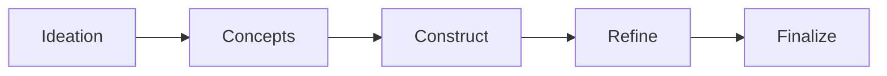
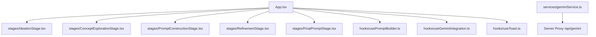

# Synergy Prompt Crafter — Comprehensive Codebase Analysis

**Date:** 2026-03-20
**Analyst:** Architect Mode
**Version Analyzed:** 0.0.0 (Initial)

---

## 1. Architectural Strengths and Best Practices

### 1.1 Clean Component Architecture

The application demonstrates a well-organized, modular file structure that separates concerns appropriately:

```text
components/   → Reusable UI primitives (ActionButton, Pill, LoadingSpinner, StageProgressBar, Icons)
services/     → External API integration (geminiService.ts)
App.tsx       → Main orchestration and state management
types.ts      → Centralized TypeScript type definitions
constants.ts  → Application-wide constants and configuration data
```

The [ActionButton](components/ActionButton.tsx) component exemplifies reusable component design—supporting variants (`primary`, `secondary`, `danger`, `ghost`), icons, disabled states, and tooltip titles through a clean interface.

### 1.2 TypeScript Strict Mode Compliance

The [tsconfig.json](tsconfig.json) enables strict mode with all major linting flags:

```json
{
  "strict": true,
  "noUnusedLocals": true,
  "noUnusedParameters": true,
  "noFallthroughCasesInSwitch": true
}
```

This enforces rigorous type safety and prevents common coding errors at compile time. The [types.ts](types.ts) file uses enums and interfaces appropriately to model the domain.

### 1.3 Service Layer Abstraction

The [geminiService.ts](services/geminiService.ts) implements a clean API service layer that:

- Centralizes all Google Gemini API interactions
- Provides status checking via `getGeminiServiceStatus()`
- Includes robust JSON parsing with fallback logic in `parseJsonFromText()`
- Maps AI responses to typed domain objects (`AiConcepts`, `RefinementSuggestion[]`)

### 1.4 Staged Workflow Pattern

The application implements a multi-stage wizard pattern driven by the [`STAGES_CONFIG`](App.tsx#L12) array in [App.tsx](App.tsx), providing a single source of truth for stage ordering:



Each stage is self-contained with validation, loading states, and error handling.

### 1.5 Accessible UI Implementation

The [StageProgressBar](components/StageProgressBar.tsx) component demonstrates strong accessibility practices:

- `aria-label="Progress"` on the navigation element
- `role="list"` with proper list semantics
- `sr-only` class for screen reader stage names
- Visual distinction between completed, current, and upcoming stages
- Error states use `role="alert"` for screen readers

### 1.6 Vite Build Configuration

The [vite.config.ts](vite.config.ts) properly configures path aliases (`@/*` → project root) and environment variable loading with `loadEnv()`. The `responseMimeType: "application/json"` config in structured API calls reduces parse failures.

### 1.7 Resilient JSON Parsing

The `parseJsonFromText<T>()` function in [geminiService.ts](services/geminiService.ts) handles both fenced code block responses and bare JSON, with a two-pass fallback strategy—a pragmatic guard against LLM output variability.

---

## 2. Technical Vulnerabilities and Security Concerns

### 2.1 API Key Exposure in Client-Side Code

#### Severity: Critical

The Gemini API key is bundled into client-side JavaScript via Vite's `define` plugin in [vite.config.ts](vite.config.ts):

```typescript
define: {
  'process.env.API_KEY': JSON.stringify(env.GEMINI_API_KEY),
  'process.env.GEMINI_API_KEY': JSON.stringify(env.GEMINI_API_KEY)
}
```

The API key is inlined as a plain string literal in the production bundle and is visible to anyone who downloads the application's JavaScript assets. Any real key will be exposed.

**Recommendation:** Implement a server-side proxy that forwards requests to the Gemini API, keeping the key exclusively in the server runtime environment. The client should call `/api/gemini/...` endpoints on your own server rather than hitting Google's API directly.

### 2.2 No Input Sanitization for AI Prompts

#### Severity: High

User-provided text is interpolated directly into AI prompts without any sanitization. In [geminiService.ts](services/geminiService.ts), `generateConcepts()` embeds the raw `idea` string:

```typescript
const prompt = `Based on the core idea "${idea}" and focusing on the disciplines [${disciplineList}]...`;
```

A malicious user can craft input that alters the instruction structure sent to the AI (prompt injection), potentially extracting system information or coercing unintended AI behavior.

**Recommendation:** Validate and sanitize user inputs—strip or escape special characters (quotes, backticks, bracket sequences) before interpolation.

### 2.3 Error Messages May Leak Internal State

#### Severity: Medium

Across all five `catch` blocks in [App.tsx](App.tsx), the raw `Error.message` is surfaced directly to users:

```typescript
setError("Failed to generate concepts. " + (e instanceof Error ? e.message : String(e)));
```

SDK error messages from `@google/genai` may contain quota identifiers, request IDs, or internal endpoint details.

**Recommendation:** Map SDK errors to user-friendly messages at the service layer boundary. Log full error details to the console only.

### 2.4 No Rate Limiting or Request Throttling

#### Severity: Medium

There is no client-side debounce or throttle on AI-triggered operations. All four action buttons (`fetchAiConcepts`, `fetchVariations`, `fetchImprovements`, `handleTestPrompt`) can be triggered while `isLoading` is `false` between rapid sequential clicks. A malicious or impatient user can exhaust API quota quickly.

**Recommendation:** Add `useDebounce` / `useThrottle` to action callbacks, or track pending request counts and block concurrent calls.

### 2.5 Potential Prompt Injection via AI Responses

#### Severity: Low

AI-generated concepts and variations are displayed using React's text rendering (not `dangerouslySetInnerHTML`), so XSS via rendered HTML is prevented. However, if the rendering layer ever changes to support Markdown or HTML, unescaped AI output could become a vector.

**Recommendation:** Maintain a lint rule or code review gate that prevents `dangerouslySetInnerHTML` from being applied to any AI-generated strings.

---

## 3. Performance Limitations and Scalability Constraints

### 3.1 Monolithic State in a Single Component

#### Severity: Medium

[App.tsx](App.tsx) manages 12 independent `useState` declarations plus two `useEffect` hooks, all co-located. Every state write triggers a full re-render of the entire tree including all stage sub-trees rendered inside `renderStageContent()`.

The `useCallback` hooks suppress ESLint's exhaustive-deps rule with inline comments:

```typescript
// eslint-disable-next-line react-hooks/exhaustive-deps
}, [coreIdea, selectedDisciplines]);
```

Intentional omissions from dependency arrays (e.g., `handleNextStage`) can cause stale closures that silently operate on outdated state values.

**Recommendation:** Use `useReducer` for related state groups, extract stage sub-trees into memoized child components, and audit all suppressed lint rules.

### 3.2 Object Identity Instability in useCallback Dependencies

#### Severity: Medium

`promptData` is passed as a `useCallback` dependency in `constructFullPrompt`. Because `setPromptData` always sets a new object reference, `constructFullPrompt` is re-created on every keystroke in the construction form, which partially defeats memoization and could lead to subtle render loops.

**Recommendation:** Use `useRef` to hold the current prompt data for callbacks that do not need to re-create on every data change, or restructure so the callback reads from a ref.

### 3.3 No Request Cancellation

#### Severity: Medium

There is no `AbortController` in any service function. If a user triggers `fetchAiConcepts`, navigates back, re-enters input, and triggers it again, both requests are in-flight. The first to resolve will win and may overwrite the result of the second depending on network timing—a classic race condition.

**Recommendation:** Pass an `AbortSignal` into each service function and pass it to the underlying fetch calls. Cancel the previous request when a new one is initiated.

### 3.4 No Virtualization for Long Lists

#### Severity: Low

The concept exploration stage renders all AI-returned concepts into the DOM simultaneously inside a `max-h-[60vh] overflow-y-auto` container. For large discipline selections, this could be hundreds of pill elements.

**Recommendation:** For production use, consider virtualization (e.g., `react-virtual`) if concept counts grow significantly.

### 3.5 Browser Compatibility: Custom Scrollbar CSS

#### Severity: Low

The CSS in [index.html](index.html) uses `scrollbar-width` and `scrollbar-color` (Firefox-standard properties that are now broadly supported), but these are not supported in Chrome < 121, Safari, or Samsung Internet. Users on those browsers see the default OS scrollbar instead of the styled one—a minor visual inconsistency.

**Recommendation:** Accept the fallback behavior as a progressive enhancement, or use a cross-browser scrollbar library. No functional impact.

---

## 4. Code Quality Deficiencies and Technical Debt

### 4.1 App.tsx Exceeds Recommended Complexity

#### Severity: High

[App.tsx](App.tsx) is ~549 lines and contains:

- 12 state variables and 3 derived state pieces
- 8 async/callback functions
- A 260-line `switch` statement rendering all five stage UIs
- Mixed concerns: API orchestration, form management, and layout

This violates the Single Responsibility Principle and makes unit testing, debugging, and stage-level feature development difficult.

**Recommendation:** Extract each `case` in `renderStageContent` into a dedicated component:

- `components/stages/IdeationStage.tsx`
- `components/stages/ConceptExplorationStage.tsx`
- `components/stages/PromptConstructionStage.tsx`
- `components/stages/RefinementStage.tsx`
- `components/stages/FinalPromptStage.tsx`

Extract stateful logic into custom hooks: `hooks/usePromptBuilder.ts`, `hooks/useGeminiIntegration.ts`.

### 4.2 Dead Code — Exported but Unused

#### Severity: Medium

Two exports in [Icons.tsx](components/Icons.tsx) are never imported anywhere:

- `ChevronDownIcon` — imported in [App.tsx](App.tsx) but not used in JSX
- `TrashIcon` — exported but not used anywhere

The [`refinePromptComponent()`](services/geminiService.ts) function in [geminiService.ts](services/geminiService.ts) is fully implemented but is never called from [App.tsx](App.tsx). This is a complete dead-code path representing unimplemented feature work.

**Recommendation:** Either integrate `refinePromptComponent` into the construction stage (its intended use) or remove it to reduce bundle size and cognitive load.

### 4.3 Duplicate Error Handling Pattern

#### Severity: Medium

Five nearly identical `try/catch/finally` blocks in [App.tsx](App.tsx) follow the same structure:

```typescript
setIsLoading(true);
setError(null);
try {
  // ...
} catch (e) {
  console.error(e);
  setError("Failed to X. " + (e instanceof Error ? e.message : String(e)));
} finally {
  setIsLoading(false);
}
```

This is a DRY violation that scatters loading and error state management across the file.

**Recommendation:** Create a `useAsyncOperation` hook:

```typescript
function useAsyncOperation<T>(fn: () => Promise<T>) {
  const [loading, setLoading] = useState(false);
  const [error, setError] = useState<string | null>(null);
  const execute = useCallback(async () => {
    setLoading(true); setError(null);
    try { return await fn(); }
    catch (e) { setError(e instanceof Error ? e.message : String(e)); }
    finally { setLoading(false); }
  }, [fn]);
  return { execute, loading, error };
}
```

### 4.4 Zero Test Coverage

#### Severity: High

The repository contains no test files whatsoever. Critical paths with no coverage include:

- `parseJsonFromText()` in [geminiService.ts](services/geminiService.ts) — the fenced-block regex and fallback logic
- `applySuggestion()` in [App.tsx](App.tsx) — the `split('Revised:')[1]` heuristic is fragile and untested
- Stage navigation (`handleNextStage` / `handlePrevStage`) — boundary conditions at first/last stage
- `handleAddKeyword()` — case-insensitive deduplication logic

**Recommendation:** Add Vitest + React Testing Library. Start with `parseJsonFromText` (pure function, easy to unit test) and the stage navigation logic.

### 4.5 Bare `alert()` Calls

#### Severity: Medium

The `copyToClipboard()` function in [App.tsx](App.tsx) uses native `alert()` for success and failure feedback. This blocks the browser event loop, cannot be styled, and breaks automated testing.

**Recommendation:** Replace with a lightweight toast/snackbar component. A simple `useState + setTimeout` based implementation is sufficient.

### 4.6 Missing tsconfig Option

#### Severity: Low

`forceConsistentCasingInFileNames` is absent from [tsconfig.json](tsconfig.json). On case-insensitive file systems (Windows/macOS), this means a developer could `import './app'` versus `import './App'` and TypeScript would not flag it—but the build would fail on Linux CI.

**Recommendation:** Add `"forceConsistentCasingInFileNames": true` to the `compilerOptions`.

### 4.7 Environment Variable Naming Inconsistency

#### Severity: Low

[vite.config.ts](vite.config.ts) injects the key under both `process.env.API_KEY` and `process.env.GEMINI_API_KEY`, but [geminiService.ts](services/geminiService.ts) reads only `process.env.API_KEY`. The duplication is harmless but confusing for developers who expect `GEMINI_API_KEY` to be the canonical name used consistently end-to-end.

**Recommendation:** Standardize on one name (`GEMINI_API_KEY`) throughout, updating the service to match.

### 4.8 Unused Type Export

#### Severity: Low

`GroundingSource` is defined in [types.ts](types.ts) and imported in [geminiService.ts](services/geminiService.ts) but is never returned or used in any current code path. It appears to be a placeholder for a planned Google Search grounding feature.

**Recommendation:** Keep with a `// TODO: used when grounding is enabled` comment, or remove until actually needed.

---

## 5. Actionable Refactoring and Enhancement Opportunities

### 5.1 Immediate Security Fixes (Priority 1)

| # | Action | Files Affected | Effort |
|---|--------|----------------|--------|
| 1 | Implement server-side API proxy to hide Gemini key | New `server/` proxy endpoint | High |
| 2 | Remove API key from client bundle | `vite.config.ts`, requires backend | High |
| 3 | Add input sanitization for user-provided idea/disciplines | `geminiService.ts` | Low |

### 5.2 Architecture Refactoring (Priority 2)

| # | Action | Files Affected | Effort |
|---|--------|----------------|--------|
| 4 | Extract five stage components from App.tsx | New `components/stages/` | Medium |
| 5 | Create `useAsyncOperation` hook | New `hooks/useAsyncOperation.ts` | Low |
| 6 | Create `usePromptBuilder` custom hook | New `hooks/usePromptBuilder.ts` | Medium |
| 7 | Add `AbortController` request cancellation | `geminiService.ts`, `App.tsx` | Low |
| 8 | Enable `forceConsistentCasingInFileNames` | `tsconfig.json` | Trivial |

### 5.3 Quality of Life Improvements (Priority 3)

| # | Action | Files Affected | Effort |
|---|--------|----------------|--------|
| 9 | Replace `alert()` with toast notification component | New `components/Toast.tsx`, `App.tsx` | Medium |
| 10 | Add Vitest + React Testing Library | New `__tests__/` | Medium |
| 11 | Integrate or remove `refinePromptComponent` dead code | `geminiService.ts`, `App.tsx` | Low |
| 12 | Standardize env var name (`GEMINI_API_KEY`) end-to-end | `geminiService.ts`, `vite.config.ts` | Trivial |

### 5.4 Proposed Component Architecture



### 5.5 Future Scalability Enhancements

| # | Action | Rationale |
|---|--------|-----------|
| 13 | Persist prompt state in `localStorage` | Preserve work across page reloads |
| 14 | Implement prompt version history with undo/redo | High-value UX for iterative prompt crafting |
| 15 | Export prompt as `.txt` / `.md` file | Practical delivery mechanism |

---

## Summary of Findings

| Category | Critical | High | Medium | Low |
|----------|----------|------|--------|-----|
| Security | 1 | 1 | 2 | 1 |
| Performance | — | — | 3 | 2 |
| Code Quality | — | 2 | 3 | 5 |

### Top 5 Immediate Actions

1. **Implement server-side API proxy** — prevents Gemini key exposure in the JS bundle (Critical Security)
2. **Extract stage components** — reduces App.tsx from 549 lines to manageable focused files (High Quality)
3. **Add Vitest unit tests** — covers the fragile `parseJsonFromText` and `applySuggestion` logic (High Quality)
4. **Add `AbortController` cancellation** — eliminates race conditions between stage transitions (Medium Performance)
5. **Replace `alert()` with a toast component** — unblocks automated tests and improves UX (Medium Quality)

---

*Analysis performed via static code analysis of all source files. Runtime profiling and load testing not included.*
