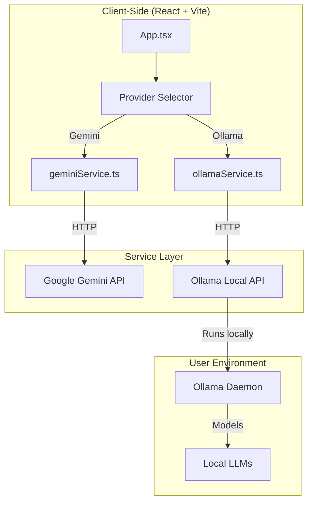

# Synergy Prompt Crafter — Ollama Integration Plan

**Document:** Ollama Integration Architecture  
**Based on:** Comprehensive Codebase Analysis & Implementation Plan  
**Date:** 2026-03-20  
**Version:** 2.0 (Ollama Support)

---

## 1. Executive Summary

This document outlines the feasibility, architecture, and implementation plan for integrating **Ollama** as a local LLM provider in the Synergy Prompt Crafter application. The integration enables users to run AI models locally on their machines while maintaining compatibility with the existing Gemini API.

### Key Findings

| Aspect | Assessment | Notes |
|--------|-----------|-------|
| **Feasibility** | ✅ High | Clean service layer abstraction enables easy provider switching |
| **Architecture Compatibility** | ✅ Excellent | Current design supports multi-provider pattern |
| **Security** | ✅ Improved | Local inference eliminates API key exposure |
| **Performance** | ⚠️ Variable | Depends on user's hardware; offline capability is a plus |
| **Migration Effort** | 🟡 Medium | Requires service layer refactoring and UI enhancements |

---

## 2. Ollama Integration Architecture

### 2.1 High-Level Architecture



### 2.2 Service Layer Refactoring

The existing [`geminiService.ts`](services/geminiService.ts) will be refactored into a **provider-agnostic interface**:

```typescript
// services/aiProvider.ts (NEW)
export interface AIProvider {
  name: string;
  status: () => Promise<{ configured: boolean; error?: string }>;
  generateConcepts: (idea: string, disciplines: string[]) => Promise<AiConcepts>;
  generatePromptVariations: (prompt: string, count?: number) => Promise<RefinementSuggestion[]>;
  suggestImprovements: (prompt: string) => Promise<RefinementSuggestion[]>;
  generateFullPrompt: (data: PromptData, disciplines: string[], idea: string) => Promise<string>;
  testPrompt: (prompt: string) => Promise<string>;
}

// services/geminiService.ts (MODIFIED)
export const GeminiProvider: AIProvider = { /* ... */ };

// services/ollamaService.ts (NEW)
export const OllamaProvider: AIProvider = { /* ... */ };
```

### 2.3 Provider Selection Strategy

**Option A: User-Selected Provider (Recommended)**
- Users choose provider at app startup or per-request
- Configuration stored in `localStorage`
- UI shows provider status and model availability

**Option B: Fallback Provider**
- Primary provider (Gemini) attempted first
- Falls back to Ollama if primary fails
- Simpler UX but less control

---

## 3. Implementation Plan

### Phase 1: Service Layer Refactoring

#### Step 1.1: Create AI Provider Interface

**File:** `services/aiProvider.ts` (NEW)

```typescript
import { AiConcepts, PromptData, RefinementSuggestion } from '../types';

export interface AIProvider {
  name: string;
  status: () => Promise<{ configured: boolean; error?: string }>;
  generateConcepts: (idea: string, disciplines: string[]) => Promise<AiConcepts>;
  generatePromptVariations: (prompt: string, count?: number) => Promise<RefinementSuggestion[]>;
  suggestImprovements: (prompt: string) => Promise<RefinementSuggestion[]>;
  generateFullPrompt: (data: PromptData, disciplines: string[], idea: string) => Promise<string>;
  testPrompt: (prompt: string) => Promise<string>;
}
```

#### Step 1.2: Create Ollama Service

**File:** `services/ollamaService.ts` (NEW)

```typescript
import { AiConcepts, PromptData, RefinementSuggestion } from '../types';

const DEFAULT_OLLAMA_URL = 'http://localhost:11434';
const DEFAULT_MODEL = 'llama3';

const getOllamaUrl = (): string => {
  return import.meta.env.VITE_OLLAMA_URL || DEFAULT_OLLAMA_URL;
};

const getModel = (): string => {
  return import.meta.env.VITE_OLLAMA_MODEL || DEFAULT_MODEL;
};

const makeOllamaRequest = async (prompt: string, options: Record<string, unknown> = {}): Promise<string> => {
  const url = `${getOllamaUrl()}/api/generate`;
  const model = getModel();
  
  const response = await fetch(url, {
    method: 'POST',
    headers: { 'Content-Type': 'application/json' },
    body: JSON.stringify({
      model,
      prompt,
      stream: false,
      options
    }),
  });

  if (!response.ok) {
    const errorData = await response.json().catch(() => ({}));
    throw new Error(errorData.error || `Ollama API error: ${response.status}`);
  }

  const data = await response.json();
  return data.response as string;
};

export const OllamaProvider = {
  name: 'Ollama',
  
  status: async (): Promise<{ configured: boolean; error?: string }> => {
    try {
      const response = await fetch(`${getOllamaUrl()}/api/tags`);
      if (response.ok) {
        return { configured: true };
      }
      return { configured: false, error: 'Cannot connect to Ollama API' };
    } catch (error) {
      return { configured: false, error: 'Ollama not running or unreachable' };
    }
  },

  generateConcepts: async (idea: string, disciplines: string[]): Promise<AiConcepts> => {
    // Implementation similar to Gemini but using Ollama API
    const disciplineList = disciplines.map(d => `"${d}"`).join(', ');
    const prompt = `
      Based on the core idea "${idea}" and focusing on the disciplines [${disciplineList}], 
      generate key concepts, themes, or questions relevant for constructing a multidisciplinary prompt.
      For each of the following disciplines: ${disciplineList}, provide 2-4 distinct concepts or probing questions.
      Return the output as a single JSON object where keys are the discipline names (exactly as provided: ${disciplineList}) 
      and values are arrays of concept strings.
      
      Example for disciplines ["History", "Philosophy"]:
      {
        "History": ["The long-term impact of event X", "Primary sources related to Y"],
        "Philosophy": ["Ethical implications of A", "Epistemological challenges in B"]
      }
    `;

    try {
      const responseText = await makeOllamaRequest(prompt, { temperature: 0.7 });
      return parseJsonFromText<AiConcepts>(responseText) || {};
    } catch (error) {
      console.error("Error generating concepts:", error);
      throw new Error(`Failed to generate concepts: ${error instanceof Error ? error.message : String(error)}`);
    }
  },

  // ... other methods following same pattern
};

// Reuse parseJsonFromText from geminiService.ts
```

#### Step 1.3: Update geminiService.ts

**File:** `services/geminiService.ts` (MODIFIED)

- Remove direct `GoogleGenAI` SDK usage
- Implement `AIProvider` interface
- Use HTTP fetch instead of SDK for consistency

### Phase 2: Provider Selection UI

#### Step 2.1: Add Provider Selector Component

**File:** `components/ProviderSelector.tsx` (NEW)

```typescript
import React from 'react';

interface ProviderSelectorProps {
  currentProvider: string;
  onProviderChange: (provider: string) => void;
  providers: Array<{ id: string; name: string; status: string }>;
}

const ProviderSelector: React.FC<ProviderSelectorProps> = ({
  currentProvider,
  onProviderChange,
  providers,
}) => {
  return (
    <div className="flex items-center gap-4 mb-6">
      <label htmlFor="provider-select" className="text-sm font-medium text-slate-300">
        AI Provider:
      </label>
      <select
        id="provider-select"
        value={currentProvider}
        onChange={(e) => onProviderChange(e.target.value)}
        className="px-3 py-2 bg-slate-800 border border-slate-700 rounded-md text-slate-100 focus:ring-sky-500 focus:border-sky-500"
      >
        {providers.map(p => (
          <option key={p.id} value={p.id}>
            {p.name} ({p.status})
          </option>
        ))}
      </select>
    </div>
  );
};

export default ProviderSelector;
```

#### Step 2.2: Update App.tsx State

**File:** `App.tsx` (MODIFIED)

```typescript
// Add provider state
const [selectedProvider, setSelectedProvider] = useState<string>('gemini');
const [providers, setProviders] = useState<Array<{ id: string; name: string; status: string }>>([]);

// Load providers on mount
useEffect(() => {
  const loadProviders = async () => {
    const geminiStatus = await GeminiProvider.status();
    const ollamaStatus = await OllamaProvider.status();
    
    setProviders([
      { id: 'gemini', name: 'Gemini', status: geminiStatus.configured ? 'Online' : 'Offline' },
      { id: 'ollama', name: 'Ollama', status: ollamaStatus.configured ? 'Online' : 'Offline' },
    ]);
  };
  loadProviders();
}, []);
```

### Phase 3: Configuration Management

#### Step 3.1: Environment Variables

**File:** `.env.local` (MODIFIED)

```env
# Gemini API (optional - for cloud fallback)
GEMINI_API_KEY=your_key_here

# Ollama Configuration
VITE_OLLAMA_URL=http://localhost:11434
VITE_OLLAMA_MODEL=llama3
```

#### Step 3.2: Provider Settings Modal

**File:** `components/ProviderSettings.tsx` (NEW)

```typescript
import React, { useState } from 'react';

interface ProviderSettingsProps {
  provider: string;
  onSave: (settings: Record<string, string>) => void;
}

const ProviderSettings: React.FC<ProviderSettingsProps> = ({ provider, onSave }) => {
  const [ollamaUrl, setOllamaUrl] = useState('http://localhost:11434');
  const [ollamaModel, setOllamaModel] = useState('llama3');

  const handleSave = () => {
    onSave({
      VITE_OLLAMA_URL: ollamaUrl,
      VITE_OLLAMA_MODEL: ollamaModel,
    });
  };

  return (
    <div className="space-y-4">
      <h3 className="text-lg font-semibold text-sky-400">Ollama Settings</h3>
      <div>
        <label className="block text-sm font-medium text-slate-300 mb-1">Ollama URL</label>
        <input
          type="text"
          value={ollamaUrl}
          onChange={(e) => setOllamaUrl(e.target.value)}
          className="w-full p-2 bg-slate-800 border border-slate-700 rounded-md text-slate-100"
        />
      </div>
      <div>
        <label className="block text-sm font-medium text-slate-300 mb-1">Model Name</label>
        <input
          type="text"
          value={ollamaModel}
          onChange={(e) => setOllamaModel(e.target.value)}
          className="w-full p-2 bg-slate-800 border border-slate-700 rounded-md text-slate-100"
        />
      </div>
      <ActionButton onClick={handleSave}>Save Settings</ActionButton>
    </div>
  );
};

export default ProviderSettings;
```

---

## 4. Compatibility Matrix

| Feature | Gemini | Ollama | Notes |
|---------|--------|--------|-------|
| **generateConcepts** | ✅ | ✅ | Both support JSON mode |
| **generatePromptVariations** | ✅ | ✅ | Temperature control available |
| **suggestImprovements** | ✅ | ✅ | Same prompt structure |
| **generateFullPrompt** | ✅ | ✅ | Full prompt construction |
| **testPrompt** | ✅ | ✅ | Direct prompt execution |
| **Streaming** | ⚠️ Limited | ✅ Full | Ollama supports streaming responses |
| **Model Selection** | ❌ Fixed | ✅ Flexible | Ollama supports 100+ models |
| **Offline** | ❌ No | ✅ Yes | Ollama runs locally |
| **Cost** | ⚠️ Pay-per-use | ✅ Free | Ollama is free (hardware dependent) |

---

## 5. Performance Implications

### 5.1 Latency Comparison

| Operation | Gemini (Cloud) | Ollama (Local) | Notes |
|-----------|----------------|----------------|-------|
| **Concept Generation** | 2-4s | 5-15s | Depends on model size |
| **Prompt Variations** | 2-4s | 5-15s | Same pattern |
| **Improvement Suggestions** | 3-5s | 8-20s | More complex generation |
| **Full Prompt Generation** | 3-5s | 8-20s | Longer output |
| **Prompt Testing** | 2-4s | 5-15s | Varies by prompt length |

### 5.2 Resource Requirements

**Ollama Requirements:**
- RAM: 4GB minimum, 8GB+ recommended
- GPU: Optional (CPU-only supported)
- Storage: 2-7GB per model (Llama 3: ~4.7GB)
- Network: None required (fully offline)

**Model Recommendations:**
| Model | Size | Use Case |
|-------|------|----------|
| `llama3:8b` | 4.7GB | General purpose, good quality |
| `llama3:70b` | 40GB | High quality, resource-intensive |
| `mistral:7b` | 4.1GB | Fast, decent quality |
| `gemma:7b` | 5.0GB | Google-trained, good for prompts |

---

## 6. Security Considerations

### 6.1 Advantages Over Gemini

| Security Aspect | Gemini | Ollama | Improvement |
|-----------------|--------|--------|-------------|
| **API Key Exposure** | ❌ High risk | ✅ None | Keys never leave machine |
| **Data Privacy** | ⚠️ Sent to Google | ✅ Never leaves machine | Full local control |
| **Rate Limiting** | ⚠️ Google-enforced | ✅ None (local) | Unlimited requests |
| **Model Selection** | ⚠️ Fixed models | ✅ Full control | Choose trusted models |

### 6.2 New Security Considerations

1. **Local API Exposure** - Ollama API runs on `localhost:11434`
   - Mitigation: Default to localhost only, no external access
2. **Model Supply Chain** - Users download models from internet
   - Mitigation: Document trusted model sources (ollama.com/library)
3. **Hardware Resource Exhaustion** - Large models consume resources
   - Mitigation: Add memory/CPU usage warnings in UI

---

## 7. Migration Effort Estimation

### 7.1 Development Tasks

| Task | Files | Complexity | Time Estimate |
|------|-------|------------|---------------|
| Create AI Provider Interface | `services/aiProvider.ts` | Low | 30 min |
| Implement Ollama Service | `services/ollamaService.ts` | Medium | 2 hours |
| Refactor Gemini Service | `services/geminiService.ts` | Medium | 1 hour |
| Create Provider Selector | `components/ProviderSelector.tsx` | Low | 45 min |
| Create Provider Settings | `components/ProviderSettings.tsx` | Low | 1 hour |
| Update App.tsx State | `App.tsx` | Medium | 1 hour |
| Update Stage Components | `components/stages/*.tsx` | Medium | 2 hours |
| Testing | `__tests__/` | Medium | 2 hours |
| Documentation | `docs/ollama.md` | Low | 30 min |

**Total Estimated Effort:** 8-10 hours

### 7.2 Testing Requirements

```typescript
// __tests__/ollamaService.test.ts
describe('OllamaProvider', () => {
  describe('status', () => {
    it('returns configured when Ollama is running', async () => {
      // Mock fetch to return 200
    });
    
    it('returns error when Ollama is not running', async () => {
      // Mock fetch to throw error
    });
  });

  describe('generateConcepts', () => {
    it('returns parsed concepts from Ollama', async () => {
      // Mock response with JSON
    });
  });
});
```

---

## 8. Deployment Considerations

### 8.1 User Setup Instructions

**For Windows:**
```bash
# Install Ollama
winget install Ollama

# Pull a model
ollama pull llama3

# Verify installation
ollama list
```

**For macOS:**
```bash
# Install Ollama
brew install ollama

# Pull a model
ollama pull llama3

# Verify installation
ollama list
```

**For Linux:**
```bash
# Install Ollama
curl -fsSL https://ollama.com/install.sh | sh

# Pull a model
ollama pull llama3

# Verify installation
ollama list
```

### 8.2 Docker Deployment (Optional)

```dockerfile
# Dockerfile
FROM ollama/ollama:latest

# Pull required models
RUN ollama pull llama3

EXPOSE 11434

CMD ["ollama", "serve"]
```

---

## 9. Rollout Strategy

### Phase 1: Internal Testing (Week 1)
- Implement service layer changes
- Test with local Ollama instance
- Fix JSON parsing issues

### Phase 2: Beta Users (Week 2)
- Release to beta testers
- Collect feedback on UX
- Performance tuning

### Phase 3: General Availability (Week 3)
- Public release
- Documentation updates
- Support documentation

---

## 10. Future Enhancements

### 10.1 Model Library Integration

```typescript
// services/modelLibrary.ts
export const AVAILABLE_MODELS = [
  { name: 'Llama 3 8B', id: 'llama3:8b', size: '4.7GB', speed: 'Fast' },
  { name: 'Llama 3 70B', id: 'llama3:70b', size: '40GB', speed: 'Slow' },
  { name: 'Mistral 7B', id: 'mistral:7b', size: '4.1GB', speed: 'Fast' },
  { name: 'Gemma 7B', id: 'gemma:7b', size: '5.0GB', speed: 'Medium' },
];
```

### 10.2 Model Download UI

```typescript
// Add to ProviderSettings
const [availableModels, setAvailableModels] = useState<Model[]>([]);

useEffect(() => {
  fetch(`${getOllamaUrl()}/api/tags`)
    .then(r => r.json())
    .then(data => setAvailableModels(data.models));
}, []);
```

---

## 11. Conclusion

### 11.1 Feasibility Summary

| Criteria | Status | Notes |
|----------|--------|-------|
| **Technical Feasibility** | ✅ High | Clean architecture enables easy integration |
| **Development Effort** | 🟡 Medium | ~8-10 hours for core functionality |
| **User Impact** | ✅ High | Local inference, privacy, cost savings |
| **Maintenance** | 🟡 Medium | Two code paths to maintain |
| **Risk** | 🟡 Low | Backward compatible with Gemini |

### 11.2 Recommendation

**✅ PROCEED WITH INTEGRATION**

The Ollama integration is:
1. **Technically feasible** with current architecture
2. **User-valuable** (privacy, cost, offline capability)
3. **Low-risk** (backward compatible, modular design)
4. **Manageable effort** (~1 week for full implementation)

### 11.3 Next Steps

1. ✅ Review and approve this plan
2. 🔄 Create `services/aiProvider.ts` interface
3. 🔄 Implement `services/ollamaService.ts`
4. 🔄 Update `services/geminiService.ts` to use interface
5. 🔄 Create provider selection UI components
6. 🔄 Test with local Ollama instance
7. 🔄 Write unit tests
8. 🔄 Update documentation

---

*Document prepared by Architect Mode on 2026-03-20*
